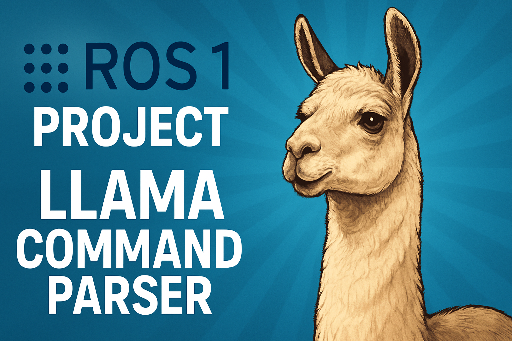

# ROS-LLaMA Project

This is a **ROS 1** project using `llama-cpp-python` with **LLaMA 3.2 Q8** for text parsing and command extraction.

We evaluated both **Gemma 3** and **LLaMA 3.2** to compare their performance and inference times.



---

## 🧠 Overview

The system processes natural language instructions and transforms them into executable robotic commands. For example:

> **Input**: "Pick the glass and place it on the kitchen table."  
> **Output**: `["pick", "glass", "place", "kitchen_table"]`

---

## 📺 Demo

[▶ Watch on YouTube](https://youtu.be/qaU2OcJ1tYU)

## 📦 ROS Nodes

There are **3 nodes** in this system:

| Node            | Script           | Description                                                  |
|-----------------|------------------|--------------------------------------------------------------|
| `ros-llama.py`  | Runs the LLaMA model | Subscribes to input topic and publishes parsed command list |
| `publisher.py`  | Publishes input text | Gets user input and publishes it to the input topic         |
| `subscriber.py` | Subscribes to output | Receives parsed command array and logs/displays it          |

These scripts are located in the `./llama-python/scripts` directory.

---

## 📁 Directory Structure

```
├── Dockerfile
├── llama-python
│   ├── catkin_ws
│   ├── json/
│   │   ├── en/
│   │   │   ├── actions_100.json
│   │   │   ├── actions.json
│   │   │   ├── examples.json
│   │   │   ├── objects_100.json
│   │   │   └── objects.json
│   │   └── ro/
│   │       ├── actiuni.json
│   │       ├── exemple.json
│   │       └── obiecte.json
│   ├── llama.py              # Starter script (non-ROS)
│   ├── models/               # GGUF models (not uploaded to GitHub)
│   └── scripts/
│       ├── publisher.py
│       ├── ros-llama.py
│       └── subscriber.py
├── README.md
├── start.sh
└── terminals.sh
```

---

## ⚙️ Framework

We use [`llama-cpp-python`](https://pypi.org/project/llama-cpp-python/0.1.9/) with OpenMP and BLAS support for optimized CPU execution.

---

## 🧩 Models

All the models we tested:

```
models/
├── gemma3/
│   ├── bartowski/     [1]
│   │   ├── google_gemma-3-12b-it-IQ2_M.gguf
│   │   └── google_gemma-3-12b-it-Q4_K_M.gguf
│   └── unsloth/       [2]
│       ├── **gemma-3-12b-it-UD-IQ2_M.gguf
│       └── **gemma-3-12b-it-Q4_K_M.gguf
└── llama3.2/
    ├── bartowski/     [3]
    │   ├── Llama-3.2-3B-Instruct-Q4_K_M.gguf
    │   └── Llama-3.2-3B-Instruct-Q6_K_L.gguf
    └── unsloth/       [4]
        ├── Llama-3.2-3B-Instruct-Q2_K.gguf
        ├── Llama-3.2-3B-Instruct-Q3_K_S.gguf
        ├── Llama-3.2-3B-Instruct-Q4_K_M.gguf
        └── Llama-3.2-3B-Instruct-Q8_0.gguf
```

The models we selected for comparison:

| Model Variant               | Filename                            | Quantized Size |
| --------------------------- | ----------------------------------- | -------------- |
| llama3.2-unsloth (Q4\_K\_M) | `Llama-3.2-3B-Instruct-Q4_K_M.gguf` | 1.9 GB         |
| llama3.2-unsloth (Q8\_0)    | `Llama-3.2-3B-Instruct-Q8_0.gguf`   | 3.2 GB         |
| gemma3-unsloth (UD-IQ2\_M)  | `gemma-3-12b-it-UD-IQ2_M.gguf`      | 4.1 GB         |
| gemma3-unsloth (Q4\_K\_M)   | `gemma-3-12b-it-Q4_K_M.gguf`        | 6.8 GB         |


---

## 🚀 Getting Started

### ⚠️ Optional Cleanup

To remove all Docker containers/images:

```bash
sudo docker stop $(sudo docker ps -aq)
sudo docker rm $(sudo docker ps -aq)
sudo docker rmi $(sudo docker images -q)
```

---

### 🔧 Start Docker + ROS Master

```bash
./start.sh
```

- This builds and starts the Docker container (`ros_llama_container`)
- Mounts `./llama-python` to `/root`
- Sets up the ROS workspace and installs scripts as ROS nodes

---

### 🖥️ Launch ROS Nodes

```bash
sudo ./terminals.sh
```

This script opens 3 new GNOME terminal windows:

- One for each node (`ros-llama.py`, `publisher.py`, `subscriber.py`)
- Each terminal stays open and lets you interact with the scripts
- Run with `sudo` to avoid entering your password for each terminal

> ⚠️ Do not modify any Python scripts under `catkin_ws/`. They are auto-copied from `./llama-python/scripts/`.

---

## 🔄 ROS Workflow

```text
[ publisher.py ]  -->  /llama_parser/input   --> [ ros-llama.py ] --> /llama_parser/commands --> [ subscriber.py ]
```

1. `publisher.py` takes user input and publishes to `/llama_parser/input`
2. `ros-llama.py` parses the text using LLaMA and publishes the command list
3. `subscriber.py` logs the parsed command list received from `/llama_parser/commands`

---

## 📊 Statistics

### Model Details

| Model Variant               | Filename                            | Layers | Size (GB) |
| --------------------------- | --------------------------------- | ------ | --------- |
| llama3.2-unsloth Q4         | `Llama-3.2-3B-Instruct-Q4_K_M.gguf` | 28     | 1.9       |
| llama3.2-unsloth Q8         | `Llama-3.2-3B-Instruct-Q8_0.gguf` | 28     | 3.2       |
| gemma3-unsloth Q2           | `gemma-3-12b-it-UD-IQ2_M.gguf`    | 49     | 4.1       |
| gemma3-unsloth Q4           | `gemma-3-12b-it-Q4_K_M.gguf`      | 49     | 6.8       |

### Test Results

**English Examples (out of 10 good outputs):**

| Model Variant               | Good Outputs |
|----------------------------|--------------|
| llama3.2-unsloth Q4         | 5            |
| llama3.2-unsloth Q8         | 8            |
| gemma3-unsloth Q2           | 10           |
| gemma3-unsloth Q4           | 10           |

**Romanian Examples (out of 10 good outputs):**

| Model Variant               | Good Outputs |
|----------------------------|--------------|
| llama3.2-unsloth Q4         | 5            |
| llama3.2-unsloth Q8         | 5            |
| gemma3-unsloth Q2           | 6            |
| gemma3-unsloth Q4           | 8            |

### Hot Start vs Cold Start (seconds)

| Model Variant               | Cold Start (s) | Hot Start (s) |
|----------------------------|----------------|---------------|
| llama3.2-unsloth Q4         | 7.243          | 1.460         |
| llama3.2-unsloth Q8         | 10.386         | 2.551         |
| gemma3-unsloth Q2           | 79.123         | 8.117         |
| gemma3-unsloth Q4           | 33.082         | 9.876         |

*Note:* `gemma3-unsloth Q4` is faster than `Q2` because CPUs are optimized for Q4/Q8 or 32-bit operations.

---

## 🔗 References

1. [Bartowski's Gemma 3 GGUF](https://huggingface.co/bartowski/google_gemma-3-12b-it-GGUF)
2. [Unsloth Gemma 3 GGUF](https://huggingface.co/unsloth/gemma-3-12b-it-GGUF)
3. [Bartowski LLaMA 3.2 GGUF](https://huggingface.co/bartowski/Llama-3.2-3B-Instruct-GGUF)
4. [Unsloth LLaMA 3.2 GGUF](https://huggingface.co/unsloth/Llama-3.2-3B-Instruct-GGUF)
5. [llama-cpp-python v0.1.9](https://pypi.org/project/llama-cpp-python/0.1.9/)

---
